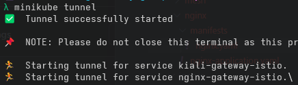

# Gateway API

To better reflect our AKS ingress moving forward, we can install [`Istio`]() and the [`Gateway API`]() CRds.

Navigate to the `argo/ignore` folder, and move these folders into the argo apps directory:
```bash
mv argo/ignore/mesh argo/apps
```

Ensure that any `repoURL` in any `*-application.yaml` files point correctly at your repository, *_not_* the template repository.

Once you commit and push these folders, the Argo dashboard should extend considerably once you trigger the sync:


We now have gateways from Gateway API, and a full Istio servicemesh in ambient mode. Additionally we have Kiali installed for distributing traces, and prometheus for metrics.

Open you nginx manifest from earlier, and ensure the namespace is labelled for istio:
```yaml
apiVersion: v1
kind: Namespace
metadata:
  name: nginx
  labels:
    istio.io/dataplane-mode: ambient
```

Once this commit is finished, nginx is now a member of the mesh!

If we run `minikube tunnel` from a terminal, we can now expose nginx using this new gateway.

Extend our `nginx.yaml` to include the following:
```yaml
# existing code above here
---
apiVersion: gateway.networking.k8s.io/v1
kind: Gateway
metadata:
  name: nginx-gateway
  namespace: nginx
  labels:
    app: nginx
    version: v1.25
spec:
  gatewayClassName: istio
  listeners:
  - name: http
    port: 8080
    protocol: HTTP
    allowedRoutes:
      namespaces:
        from: Same
---
apiVersion: gateway.networking.k8s.io/v1
kind: HTTPRoute
metadata:
  name: nginx-route
  namespace: nginx
  labels:
    app: nginx
    version: v1.25
spec:
  parentRefs:
  - name: nginx-gateway
    group: gateway.networking.k8s.io
    kind: Gateway
  rules:
  - backendRefs:
    - name: nginx
      kind: Service
      group: ""
      port: 80
      weight: 1
    matches:
      - path:
          type: PathPrefix
          value: /
```

Once these changes have been sync'd and pushed:


The tunnel will reflect the new gateway:


And nginx will be browsable on [127.0.0.1:8080](http://127.0.0.1:8080)

For good measure, navigate to `argo/argocd/manifests` and remove the `.bck` suffix from `gateway.yaml.bck`. This will expose a route to argo :rocket: