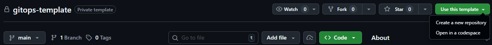
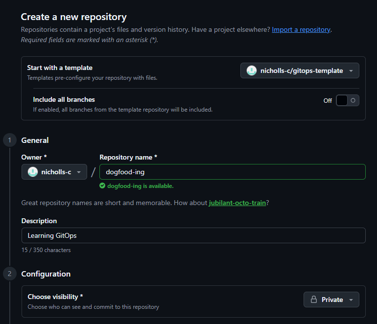
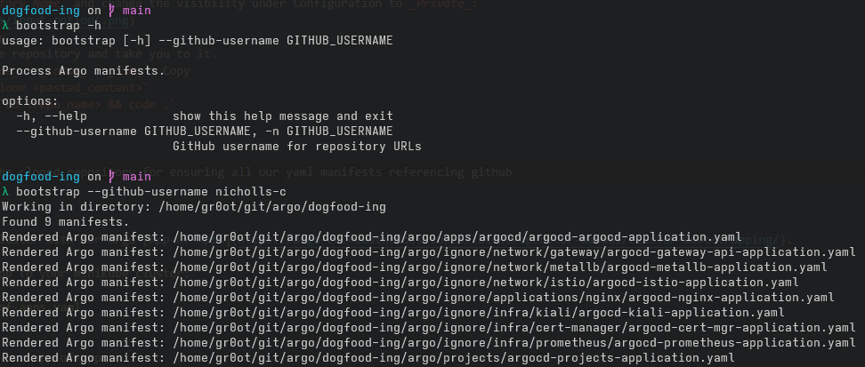

# Getting Started

## Clone Template Directory

There is a starter repository that can be cloned that will help boostrap a new local cluster.

1. Navigate to [gitops-template repository](https://github.com/nicholls-c/gitops-template)
2. Clone template repository: _Use this template_ > _Create a new repository_  
   
3. Add an _Owner_, _Repository Name_ and change the visibility under Configuration to _Private_:  
   
4. Click _Create repository_
5. GitHub should create the repository and take you to it.
6. Grab git clone url: _Code_ > _Local_ > _SSH_ > Copy
7. In bash, execute `git clone <pasted_content>`
8. Open in IDE of choice: `cd <repo_name> && code .`

## Bootstrap Local Cluster

There's a CLI bundled in the cloned repository for ensuring all our yaml manifests referencing github correctly.

Execute:
```bash
./utilities/bootstrap --github-username nicholls-c
```

Expected output:  


## App-of-Apps

We can now bootstrap our cluster with our Argo [App-of-Apps](https://argo-cd.readthedocs.io/en/latest/operator-manual/cluster-bootstrapping/).

Apply our Argo bootstrap app to your minikube cluster:
```bash
kubectl apply -f argo/app-of-apps.yaml
```

The ArgoUI should now show our app-of-apps:  
