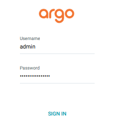

# ArgoCD

- [ArgoCD](#argocd)
  - [Install](#install)
  - [Authenticate](#authenticate)

<br>

## Authenticate

### Create and set a namespace for ArgoCD:  
```bash
kubectl create namespace argocd; 
kubectl ns argocd;
```

### Create a kubernetes secret from your github `ssh` key (don't do this for prod :tongue:).

Update the path to your private github ssh key, and the name of your personal github.
```bash
kubectl create secret generic github-ssh \
  --namespace argocd \
  --from-file=sshPrivateKey=/home/gr0ot/.ssh/id_ed25519 \
  --from-literal=type=git \
  --from-literal=url=git@github.com:nicholls-c
```

Label the secret for Argo:
```bash
kubectl label secret github-ssh -n argocd argocd.argoproj.io/secret-type=repo-creds
```

## Install

1. Install ArgoCD CRDs:
   ```bash
   kubectl apply -n argocd -f https://raw.githubusercontent.com/argoproj/argo-cd/v3.2.1/manifests/install.yaml
   ```
2. Verify installation: `kubectl -n argocd get statefulset`

---

## Use

If you now forward the Argo service, you should get the UI rendering (you should also be able to click through `Settings` > `Repository` and see your personal org).
```bash
kubectl port-forward svc/argocd-server -n argocd 8082:443
```

To sign in to the UI, username is `admin`:  


The initial password can be retrieved using the following command:
```bash
kubectl -n argocd get secret argocd-initial-admin-secret -o jsonpath="{.data.password}" | base64 -d; echo
```

Which should lead you to the default UI.


If you have installed the Argo CLI, you can also authenticate that:
```bash
argocd login localhost:8082 --username admin --password "$(kubectl -n argocd get secret argocd-initial-admin-secret -o jsonpath="{.data.password}" | base64 -d; echo)" --insecure
```
