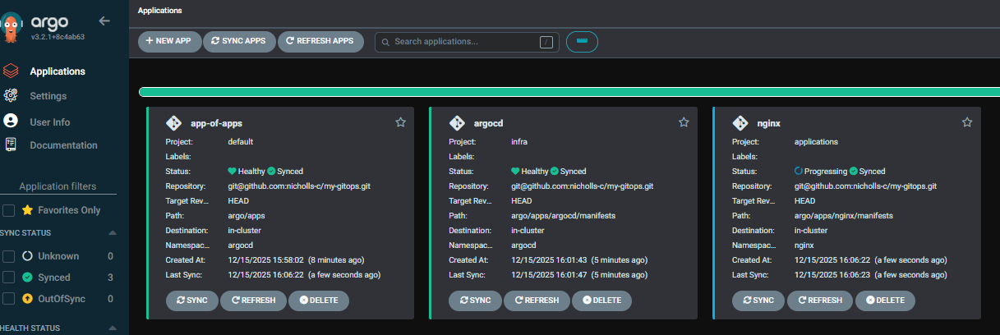
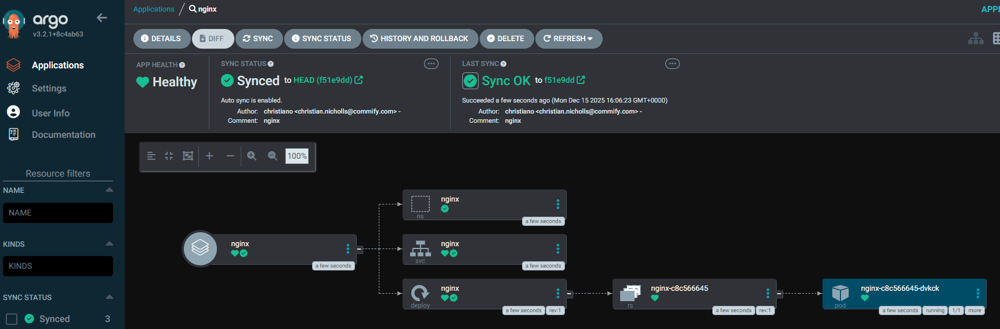

# Next Steps

Let's create a simple nginx app.

First, we'll create a new argo application for our nginx deployment.

1. Create a new folder for our deployment:
2. `mkdir -p argo/apps/nginx argo/apps/nginx/manifests`
3. Create the `argo/apps/nginx/nginx-application.yaml` from the following:
   ```yaml
   apiVersion: argoproj.io/v1alpha1
   kind: Application
   metadata:
     name: nginx
     namespace: argocd
     finalizers:
       - resources-finalizer.argocd.argoproj.io
   spec:
     project: applications
     source:
       # make sure to update this ref!!
       repoURL: git@github.com:nicholls-c/my-gitops.git
       targetRevision: HEAD
       # path to application manifests
       path: argo/apps/nginx/manifests

     destination:
       server: https://kubernetes.default.svc
       namespace: nginx

     syncPolicy:
       automated:
         prune: true
         selfHeal: true
       syncOptions:
         - CreateNamespace=true
         - ServerSideApply=true
   ```
4. Create the following `nginx.yaml` in `argo/apps/nginx/manifests`:
   ```yaml
   ---
   apiVersion: v1
   kind: Namespace
   metadata:
     name: nginx
     #labels:
     #  istio.io/dataplane-mode: ambient
   ---
   apiVersion: apps/v1
   kind: Deployment
   metadata:
     name: nginx
     namespace: nginx
     labels:
         app: nginx
         version: v1.25
   spec:
     selector:
       matchLabels:
         app: nginx
     template:
       metadata:
         labels:
           app: nginx
           version: v1.25
       spec:
         containers:
         - name: nginx
           image: nginx:1.25
           ports:
           - name: http
             containerPort: 80
   ---
   apiVersion: v1
   kind: Service
   metadata:
     name: nginx
     namespace: nginx
     labels:
       app: nginx
       version: v1.25
   spec:
     ports:
     - name: http
       port: 80
       protocol: TCP
       targetPort: 80
     selector:
       app: nginx
     type: ClusterIP
   ```

5. Commit to git:
```bash
git add .;
git commit -m 'feat: nginx argo app';
git push
```

6. And navigate back to our Argo App-of-Apps and click _Sync_ > _Synchronize_, we should see our `nginx` Argo app:
   

7.  Navigate into our app, and it should reconcile and show as sync'd:
   

<br>

Now if we forward the nginx service: `kubectl -n nginx port-forward svc/nginx 8080:80`

We should get a `200` response from `curl`, and the default nginx site in our browser:


<br>


